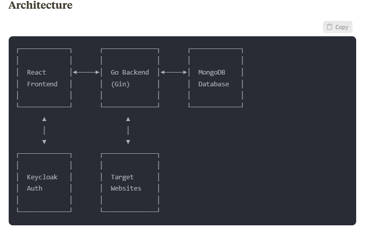

                              Local Deployment Guide

Get the GO back-end source code from below repository.

_**https://github.com/wmbpbw/web_page_analyzer_go**_

•
Firstly, deploy the Go backend application. It will deploy go-backend, keycloak , and mongodb as well.

•
Execute below command on GO Backend project root location.

**docker-compose up -d**

Then configure keycloak by accessing below url (Before deploying front-end app).

**Keycloak url : http://localhost:8080**

Login to keycloak admin portal (**username : admin, password : admin**)

Create a realm called “**web-analyzer**”

Create a Realm user (any username, email, first name, last name).

Go to credentials tab and provide credentials for new user.( Make sure temporary password option disabled to use the. Otherwise have to provide a new password at first login)

Goto relam clients and import clients using given JSON files. This will create two clients with all the configurations.

Get JSON files from this  repo : **https://github.com/wmbpbw/keyclok-client-data**

Below are the files

▪
**web-analyzer-backend**

▪
**web-analyzer-frontend**

No need to do anything with mongodb. All setup with the deployment. Can access using Mongo compass with below url if necessary.

**mongodb://localhost:27017**

**Then follow REACT front-end README file instructions to deploy REACT app.**

                                  **Web Page Analyzer**

A modern web application that analyzes webpages and provides detailed information about their structure and components.
Features

URL Analysis: Submit any URL to get detailed analysis of the webpage
HTML Version Detection: Identifies the HTML version used by the webpage
Page Title Extraction: Retrieves and displays the title of the analyzed page
Heading Analysis: Counts headings by level (H1-H6) with visual representation
Link Analysis:

Identifies and counts internal vs. external links
Reports on inaccessible/broken links
Provides detailed link information with status codes

Login Form Detection: Identifies if the page contains login forms
Comprehensive Error Handling:

Meaningful error messages with HTTP status codes
Detailed error descriptions for unreachable URLs

Analysis History: Stores and displays previous analysis results
Secure Authentication: Keycloak integration for secure user access
Responsive Design: Works across desktop and mobile devices

**Technology Used**

**Backend**

Language: Go (Golang)

Web Framework: Gin for HTTP handling and routing

HTML Parsing: goquery (Go implementation of jQuery-like functionality)

Database: MongoDB for storing analysis history

ORM: GORM for database operations

Authentication: Keycloak integration for secure authentication

Logging: slog for structured logging

Error Handling: Custom error package with proper status codes and messages

Concurrency: Go routines and wait groups for concurrent link validation

Testing: Go's native testing package with testify for assertions

API Documentation: Inline code documentation

Containerization: Docker for deployment

Dependency Management: Go modules

**Frontend**

Framework: React for building the user interface

State Management: React Hooks (useState, useEffect, useContext)

Styling: Tailwind CSS for responsive design

HTTP Client: Axios for API requests

Authentication: Keycloak JS adapter for frontend authentication

Charting: Recharts for visual representation of analysis data

Form Handling: React Hook Form for form validation

Error Handling: Custom error boundary components

Testing: Jest and React Testing Library

Build Tool: Vite

**DevOps**

Version Control: Git

Containerization: Docker with multi-stage builds

Deployment: Docker Compose for local deployment, instructions for cloud deployment

**Limitations**

JavaScript Rendered Content

Cannot analyze content rendered via JavaScript after initial page load
Dynamic content may not be included in the analysis

Authentication Barriers

Cannot analyze pages behind login screens without credentials
Restricted content remains inaccessible

Rate Limiting

Target websites may implement rate limiting, blocking repeated requests
Could lead to incomplete analysis for sites with strict security measures

Large Websites

Analysis of websites with thousands of links may be time-consuming
May hit timeout limits for extremely large sites

Complex Link Structures

Some modern web applications use non-standard link formats
Links implemented via JavaScript events may not be detected

Internationalization

Limited support for non-Latin character sets in analysis results
May have issues with right-to-left languages

Login Form Detection Accuracy

Login form detection uses heuristics and may have false positives/negatives
Non-standard login forms might be missed

Connection Dependencies

Requires stable internet connection for accurate link validation
Network fluctuations may affect analysis results

**Potential Improvements**

Enhanced Analysis (Under this section most of them implemented as additional featuressu as
**LoadTime,
TTFB,
Size,
Resources,
MetaTags,
Images,
Accessibility ,
Content,
Security ,
Mobile,
Social,
Technology,
Media,
Schema,
Cookies,
Links**
)

Add SEO analysis features (meta tags, keyword density)
Add accessibility compliance checking
Implement performance metrics analysis
Add image analysis (alt tags, sizes, optimization suggestions)

Headless Browser Integration

Integrate with headless browser (e.g., Playwright, Puppeteer via WebAssembly or API)
Enable analysis of JavaScript-rendered content
Support for single-page applications

Advanced Authentication

Allow users to provide credentials for analyzing protected pages
Support for cookie-based authentication

Scalability Enhancements

Implement job queue for handling large analysis tasks
Add worker pool for distributed processing
Optimize for cloud-native deployment

Visualization Improvements

Add site structure visualization (sitemap)
Implement interactive network graphs for link relationships
Enhance data visualization with more detailed charts

Reporting

Add PDF report generation
Implement scheduled analysis with email notifications
Add comparison feature between different analysis runs

API Extensions

Develop a complete RESTful API with documentation
Add webhook support for analysis completion notification
Implement batch analysis for multiple URLs

Machine Learning Integration

Add content classification
Implement sentiment analysis
Add anomaly detection for identifying unusual page structures

Caching Strategy

Implement intelligent caching to reduce repeated analysis
Add cache invalidation based on content changes

International Support

Add full Unicode support
Implement language detection
Add translations for the UI